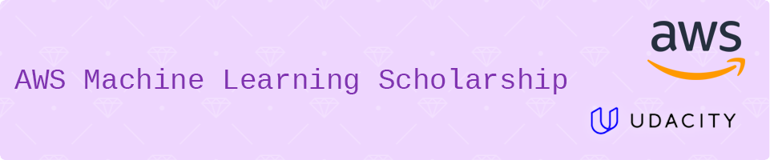

# AWS Machine Learning Scholarship Projects (2024)

This repository showcases the projects completed for the AWS ML Scholarship program (2024 Cohort), offered by AWS in collaboration with Udacity. This comprehensive program provided a foundation in Machine Learning and Deep Learning and was offered to a limited number of graduates of the 2023 AWS AI & ML Scholarship.

## Repository Structure:

* [**capstone-project**](https://github.com/kattat13/AWS-MachineLearning-2024/tree/main/capstone-project): This folder contains the project focused on building a Machine Learning Workflow for Scones Unlimited on Amazon SageMaker.
* **exploratory-projects**: This folder contains projects exploring various aspects of Machine Learning and Deep Learning:
    * [Project 1: Predict Bike Sharing Demand with AutoGluon](https://github.com/kattat13/AWS-MachineLearning-2024/tree/main/exploratory-projects/1-bike-sharing-autogluon)
    * [Project 2: Developing a Handwritten Digits Classifier with PyTorch](https://github.com/kattat13/AWS-MachineLearning-2024/tree/main/exploratory-projects/2-digits-classifier)
    * [Project 3: Landmark Classification & Tagging for Social Media](https://github.com/kattat13/AWS-MachineLearning-2024/tree/main/exploratory-projects/3-landmark-classification)

## Deep Learning Topics Covered:

The scholarship program provided experience with various Deep Learning topics including:

* Introduction to Deep Learning concepts
* Convolutional Neural Networks (CNNs)
* Transfer Learning
* Autoencoders
* Object Detection and Segmentation
