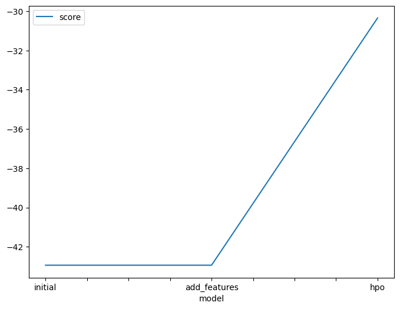
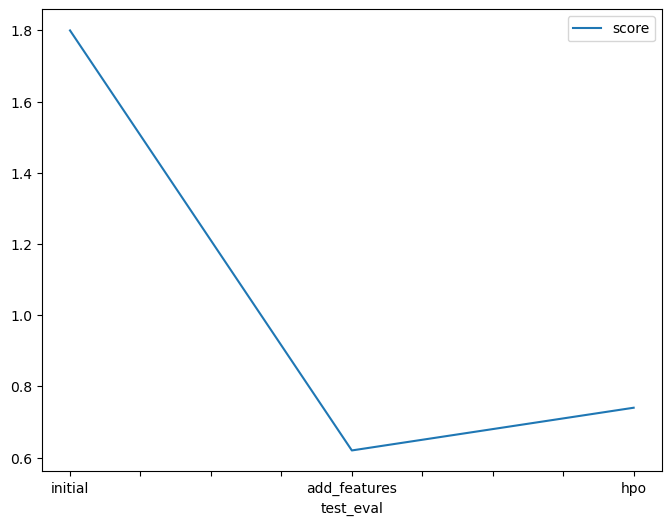

# Report: Predict Bike Sharing Demand with AutoGluon Solution
#### Katarzyna Tatomir

## Initial Training
### What did you realize when you tried to submit your predictions? What changes were needed to the output of the predictor to submit your results?
DONE: After my initial training, I noticed the predictions might include negative values. Since Kaggle only accepts positive values for this competition, I addressed this in two steps:

    I counted the number of negative predictions.
    I replaced all negative predictions with zeros.

Finally, I added these adjusted predictions to the submission dataframe which can then be submitted to Kaggle.

### What was the top ranked model that performed?
DONE: Default AutoGluon model with new features created from datatime feature had the best score of 0.62.

## Exploratory data analysis and feature creation
### What did the exploratory analysis find and how did you add additional features?
DONE: During Exploratory Data Analysis (EDA), I made two key observations about the data:

     I transformed the datetime column from its original format (object dtype) to a proper datetime format. This allowed me to extract additional features like year, month, day, and hour.
     By visualizing the data distributions through histograms, I identified two main data types: categorical and continuous. Among the categorical features, 'season' and 'weather' provided more informative categories compared to 'holiday' and 'workingday' which were simply binary (0 or 1). To leverage this information, I converted 'season' and 'weather' from numerical data (int64) to categorical data types.
     After that, inspired by insightful notebooks on Kaggle on the same competition, I decided to use code from https://www.kaggle.com/code/sumn2u/bike-sharing-demand-random-forest#Feature-Engineering to create new features: `peak` for peak hour around 7 AM and 5 PM, `holiday` for specific dates of holidays, `workingday` to correct the working day status for December 24 and 31 to be non-working days, `ideal` for ideal weather based on temperature and windspeed, and `sticky` for when humidity is high on working day.

### How much better did your model preform after adding additional features and why do you think that is?
DONE: The model performed much better after adding features due to capturing more relevant information and enabling the model to learn complex relationships.

## Hyper parameter tuning
### How much better did your model preform after trying different hyper parameters?
DONE: Model performed worse when I used hyper parameter optimization. This is likely because AutoGluon is built to automatically find the best parameters, it's also written in the documentation.

### If you were given more time with this dataset, where do you think you would spend more time?
DONE: I would create more visualizations to maybe find other features that can be engineered.

### Create a table with the models you ran, the hyperparameters modified, and the kaggle score.
|model|hpo1: num_bag_folds|hpo2|hpo3|score|
|--|--|--|--|--|
|initial|8|8|10|1.8|
|add_features|1|1|3|0.6|
|hpo|1|1|5|0.7|

### Create a line plot showing the top model score for the three (or more) training runs during the project.

DONE: Replace the image below with your own.

### Create a line plot showing the top kaggle score for the three (or more) prediction submissions during the project.

DONE: Replace the image below with your own.

## Summary
DONE: I built a model to predict bike sharing demand using AutoGluon in SageMaker Studio. The data came from Kaggle, and I ran it on an AWS instance with Python. At first, I kept things simple and got a pretty high error score (RMSE: 1.8).

To improve the model, I dug deeper into the data (EDA) and created new features based on the date and time. This helped a lot (RMSE: 0.67). Then, I played around with different settings for the model (hyperparameter tuning) and found that the score wasn't better than the defaul parameters. 

At the end, I tried to experiment with singular models and tried: LightGBM, XGBoost, CatBoost and RandomForest. I received the best score then, using RandomForest - 0.39 score on Kaggle.
