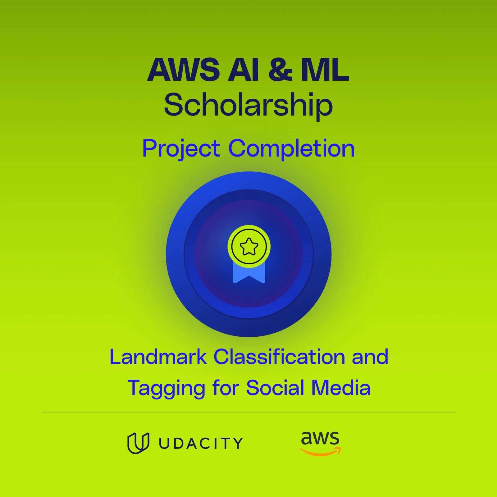

# Project Name: *Landmark Classification & Tagging for Social Media*

|                    |                                                                                               |
|--------------------|-----------------------------------------------------------------------------------------------|
| Libraries Used     | - PyTorch: For building and training deep learning models.<br>- Torchvision: For image transformations and pre-trained models.<br>- NumPy: For numerical operations and data manipulation.<br>- Pandas: For data handling and analysis.<BR>- Matplotlib: For data visualization and plotting results.<BR>- Seaborn: For enhanced data visualization.<BR>- Scikit-learn: For model evaluation metrics and confusion matrix generation.|
| Dataset            | Landmark Images Dataset: A collection of images containing various landmarks, used for training and testing the model. |
| Tools Used         | - Jupyter Notebook: For interactive coding and documentation of the project workflow.<BR>- Anaconda: For managing the project environment and dependencies.<BR>- Git: For version control and collaboration.<BR>- TorchScript: For exporting the trained model for deployment.<BR>- Visual Studio Code: For code editing and development.|


## Project Overview



The Landmark Classification & Tagging for Social Media 2.0 project is designed to develop a robust machine learning model capable of identifying and classifying various landmarks from images. This project leverages deep learning techniques, specifically Convolutional Neural Networks (CNNs), to achieve high accuracy in landmark recognition, making it suitable for applications in social media tagging and image categorization.

## Key Features

- **Custom CNN Architecture**: Implemented a CNN from scratch to classify landmarks, allowing for a deep understanding of neural network design and functionality.
- **Transfer Learning**: Utilized pre-trained models to enhance classification performance, demonstrating the effectiveness of transfer learning in computer vision tasks.
- **Data Augmentation**: Applied various data augmentation techniques to improve model robustness and reduce overfitting, ensuring better generalization to unseen images.
- **Image Preprocessing**: Developed a comprehensive data preprocessing pipeline, including resizing, cropping, normalization, and augmentation, to prepare images for training.
- **Model Evaluation**: Conducted thorough model evaluation using validation and test datasets, achieving a test accuracy of at least 60% for transfer learning models.
- **TorchScript Export**: Implemented model export functionality using TorchScript, enabling easy deployment and inference in production environments.
- **Interactive Application**: Created a user-friendly application that loads the trained model and allows users to upload images for landmark classification, showcasing the model's capabilities in real-time.

## Learning Outcomes

- **Deep Learning Fundamentals**: Gained hands-on experience in building and training deep learning models using PyTorch.
- **CNN Design and Implementation**: Developed skills in designing CNN architectures tailored for specific tasks, understanding the impact of different layers and parameters.
- **Transfer Learning Techniques**: Learned how to effectively leverage pre-trained models to improve performance on limited datasets.
- **Data Handling and Augmentation**: Enhanced understanding of data preprocessing and augmentation strategies to optimize model training.
- **Model Evaluation and Optimization**: Acquired skills in evaluating model performance, tuning hyperparameters, and implementing learning rate schedulers.
- **Deployment Skills**: Gained experience in exporting models for production use, ensuring that the models can be easily integrated into applications.

## Project Structure

```bash
Landmark_Classification_Tagging/ 
│
├── cnn_from_scratch.ipynb
│ 
├── transfer_learning.ipynb
│ 
├── app.ipynb
│ 
├── src/ 
│ ├── train.py 
│ ├── model.py 
│ ├── helpers.py 
│ ├── predictor.py 
│ ├── transfer.py 
│ ├── optimization.py 
│ └── data.py 
```

### File Descriptions

- **cnn_from_scratch.ipynb**: This Jupyter notebook is dedicated to building and training a convolutional neural network (CNN) from scratch. It includes data loading, preprocessing, model definition, training, and evaluation steps.

- **transfer_learning.ipynb**: This notebook focuses on implementing transfer learning techniques using a pre-trained model. It allows for faster training and improved accuracy by leveraging existing knowledge from models trained on large datasets.

- **app.ipynb**: This notebook serves as the application interface where users can upload images of landmarks. It utilizes the trained model to classify and tag the images, providing a user-friendly experience.

- **src/train.py**: This script contains the core functions for training the model. It includes the training loop, validation process, and logic for saving the best model weights based on validation performance.

- **src/model.py**: This file defines the architecture of the neural network used for landmark classification. It includes the layers, activation functions, and the forward pass method.

- **src/helpers.py**: This script includes various helper functions that assist with data visualization, processing, and other utility tasks that support the main functionalities of the project.

- **src/predictor.py**: This file is responsible for loading the trained model and making predictions on new images. It applies necessary transformations and outputs the predicted labels.

- **src/transfer.py**: This script implements the transfer learning process, including freezing the layers of the pre-trained model and adding a new classifier layer specific to the landmark classification task.

- **src/optimization.py**: This file defines the loss functions and optimizers used during the training process. It includes functions for setting up the optimizer and calculating the loss.

- **src/data.py**: This script handles data loading and preprocessing, including data augmentation techniques to enhance the training dataset's diversity.

